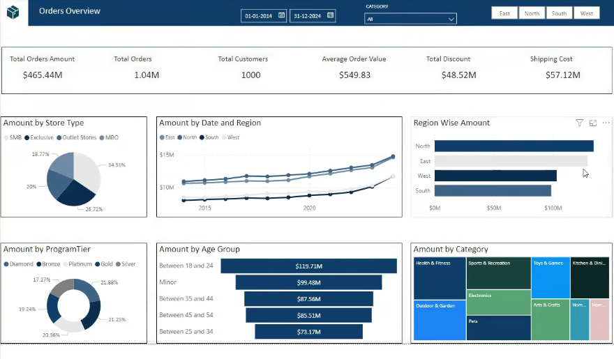

# Data Warehouse and Business Intelligence Project

This project provides a comprehensive framework for building and populating a data warehouse environment, supporting business intelligence and analytics use cases. It includes database schema scripts, synthetic data generators, and supporting documentation to simulate a retail scenario with multiple stores, products, and customers.

The solution is organized into modular components:
- **Database scripts** for creating and managing the data warehouse schema.
- **Python scripts** for generating realistic dimension and fact data, leveraging both randomization and lookup tables.
- **Lookup and reference data** to ensure consistency and realism in generated datasets.
- **Landing and staging directories** for managing generated and processed data files.
- **Documentation and diagrams** to support understanding and further development.

This project is ideal for learning, prototyping, or demonstrating data warehousing concepts, ETL processes, and business intelligence workflows in a controlled, reproducible environment.

## Project Structure

```
DB Code/
    DDL.sql
Excel/
    ER Diagram.xlsx
Landing Directory/
    Store_*.csv
Lookup Data/
One Time Load/
Python Files/
    Burst_Store_Data.py
    DimCustomerData.py
    DimProductData.py
    DimStoreData.py
```

## Folder Descriptions

- **DB Code/**  
  Contains database scripts, such as `DDL.sql`, for creating and managing the data warehouse schema.

- **Excel/**  
  Contains supporting Excel files, such as entity-relationship diagrams.

- **Landing Directory/**  
  Stores generated CSV files for each store, e.g., `Store_1_20240728.csv`, which are created by the data generation scripts.

- **Lookup Data/**  
  Intended for lookup/reference data, such as Excel files used for generating dimension data.

- **One Time Load/**  
  Reserved for scripts or data used in initial/one-time loads.

- **Python Files/**  
  Contains Python scripts for generating synthetic data for the data warehouse.

## Python Scripts

### [`Python Files/Burst_Store_Data.py`](Python%20Files/Burst_Store_Data.py)
Generates transactional data for stores and outputs CSV files to the Landing Directory.  
**Columns generated:**
- DateID (random date in range)
- ProductID (random)
- StoreID (random)
- CustomerID (random)
- QuantityOrdered (random)
- OrderAmount (random)
- DiscountAmount (calculated)
- Shipping Cost (calculated)
- TotalAmount (calculated)

### [`Python Files/DimCustomerData.py`](Python%20Files/DimCustomerData.py)
Generates synthetic customer dimension data using the Faker library.  
**Columns generated:**
- First Name, Last Name, Gender, DateOfBirth, Email, Phone Number, Address, City, State, Postal Code, Country, LoyaltyProgramID

### [`Python Files/DimProductData.py`](Python%20Files/DimProductData.py)
Generates product dimension data using lookup values from an Excel file.  
**Columns generated:**  
- Product Name, Category, and other product-related attributes (from lookup Excel sheets)

### [`Python Files/DimStoreData.py`](Python%20Files/DimStoreData.py)
Generates store dimension data using lookup values from an Excel file and Faker for address details.  
**Columns generated:**  
- StoreName, StoreType, StoreOpeningDate, Address, City, State, Country, Region, Manager Name

## Lookup Data

The scripts [`DimProductData.py`](Python%20Files/DimProductData.py) and [`DimStoreData.py`](Python%20Files/DimStoreData.py) require an Excel file (e.g., `LookupFile.xlsx`) with relevant sheets and columns for product and store lookup values.

## How to Use

1. **Install dependencies:**  
   - Python 3.x  
   - pandas  
   - faker  
   - (Optional) openpyxl for Excel support

   ```sh
   pip install pandas faker openpyxl
   ```

2. **Run the scripts:**  
   Each script will prompt for the number of rows and output file name.  
   Example:
   ```sh
   python "Python Files/DimCustomerData.py"
   ```

3. **Generated files:**  
   Output CSV files will be saved in the specified location, typically in the `Landing Directory/`.

## Notes

- Ensure the lookup Excel file paths in the scripts are correct for your environment.
- The scripts are interactive and require user input for row counts and file